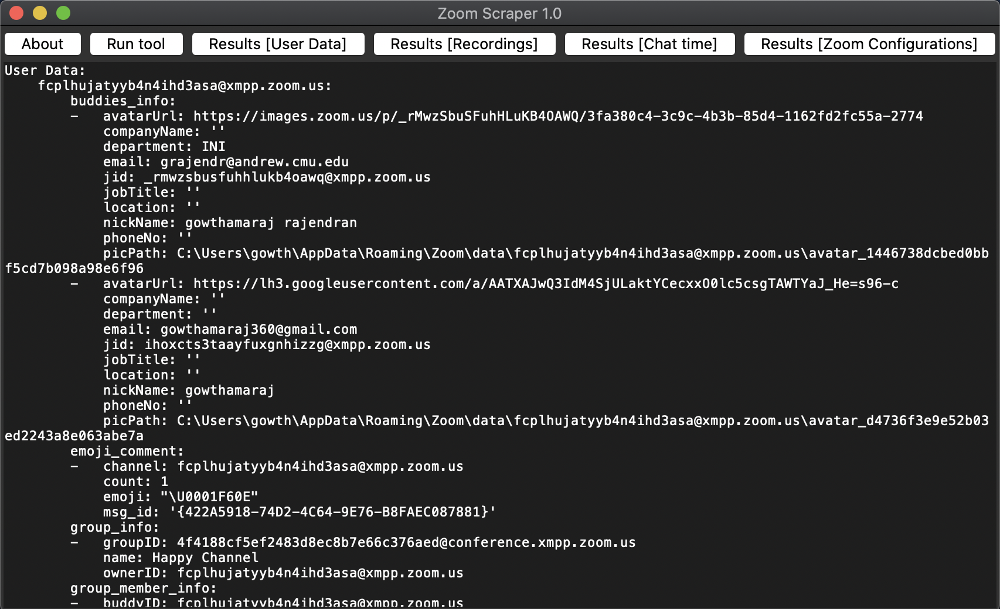

# Zoom Scraper - Video Conference Software Forensics

## Introduction

In today’s world, video conferencing software has become a key instrument in the workplace and day-to-day life. Due to the ongoing Covid-19 pandemic, Zoom has seen an astounding growth of 2900% in daily users since December 31, 2019, with more than 300 million daily meeting participants. However, there are still no good free and open-source tools to collect and analyze artifacts created by Zoom. This project aims to develop a tool to examine the Zoom artifacts that remain on the host system after usage. In this project, I build the “Zoom Scraper”  tool which can collect user data, recordings, chat time, and configurations automatically and help forensic investigators. 

## Set up

- To extract the data
`python app.py`

- To browse the data
`python zoom.py`

## Screenshots
